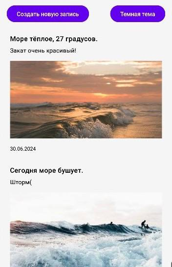
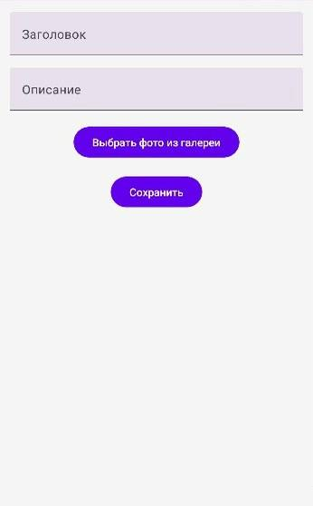
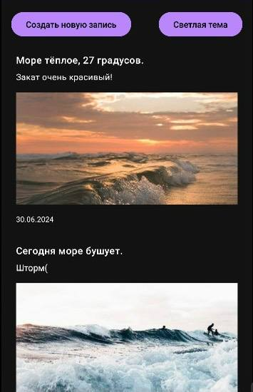

# Diary App (Личный Дневник)

**Diary App** - это приложение для создания заметок про море. Приложение поддерживает два языка (русский и английский) и две темы (светлая и тёмная). Код написан на Котлине. В приложение настроены CI/CD скрипты с использованием GitHub Workflows. Приложение подключено к Firebase и использует Crashlytics для сбора краш-отчетов и ANR. Проект распространяется под открытой лицензией.

## Функциональные возможности

- **Создание заметок** с заголовком, описанием, датой и фотографией из галереи.
- **Поддержка светлой и тёмной темы**.
- **Локализация** на два языка: русский и английский.
- **Интерфейс** с лентой новостей, отображающий все записи.
- **Поддержка Firebase** для сбора краш-отчетов с помощью Crashlytics.

## Технологии

- **Язык программирования:** Kotlin
- **База данных:** Room
- **UI:** Jetpack Compose
- **Firebase:** Firestore, Crashlytics
- **CI/CD:** GitHub Actions

## Скриншоты основных функций приложения





## Запуск проекта

### Шаги для запуска

1. **Клонирование репозитория**

    ```bash
    git clone https://github.com/uvanqz/Diary.git
    ```

2. **Открытие проекта в Android Studio**

    - Запустите Android Studio.
    - Выберите "Open an existing project" и выберите папку с проектом.

3. **Настройка Firebase**

    - Создайте проект в Firebase Console.
    - Добавьте приложение Android в Firebase и скачайте `google-services.json`.
    - Скопируйте `google-services.json` в папку `app` вашего проекта.

4. **Установка зависимостей**

    - Убедитесь, что Gradle синхронизирован.
    - Выполните команду сборки:

    ```bash
    ./gradlew build
    ```

5. **Запуск на устройстве**

    - Подключите устройство или откройте эмулятор.
    - Нажмите кнопку "Run" в Android Studio.

### CI/CD с использованием GitHub Actions

Проект настроен для автоматической сборки и тестирования с использованием GitHub Actions.

### Firebase Crashlytics

Firebase Crashlytics интегрирован для сбора краш-отчетов и ANR.

- **Подключение Crashlytics**
    - Убедитесь, что вы добавили `google-services.json` в папку `app`.
    - Включите Crashlytics в Firebase Console.

## Лицензия

Этот проект распространяется под открытой лицензией. Подробнее смотрите в файле [LICENSE](LICENSE).

## План реализации дальнейших шагов

### Оптимизация пользовательского интерфейса

- Добавить больше анимаций для улучшения пользовательского опыта.
- Разработать адаптивный интерфейс для планшетов и других устройств с большими экранами.

### Улучшение функциональности

- Добавить возможность редактирования и удаления заметок.
- Реализовать возможность добавления нескольких фотографий к одной заметке.
- Внедрить поиск и фильтрацию заметок.

## Заключение

Проект Diary App - это мощное и гибкое приложение для создания и управления заметками.

Если у вас возникли вопросы или предложения по улучшению проекта, не стесняйтесь открывать новые issues или отправлять pull requests.